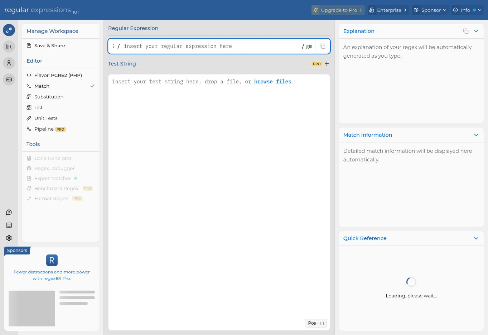
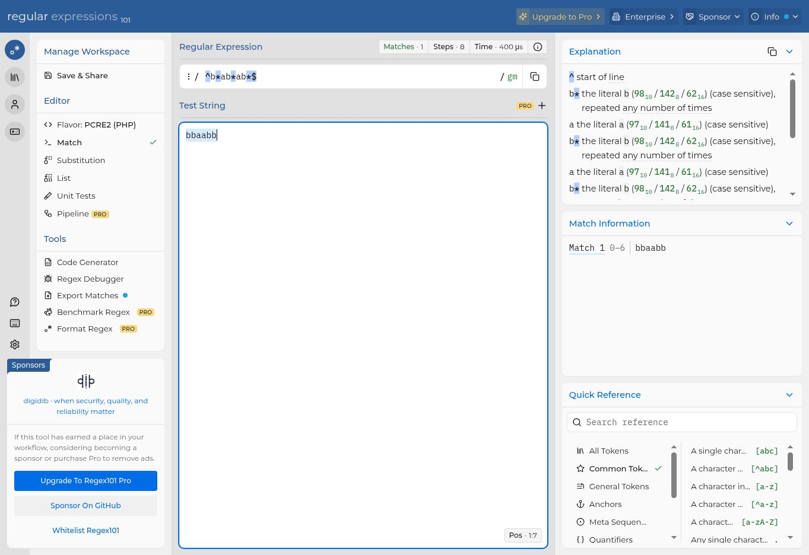
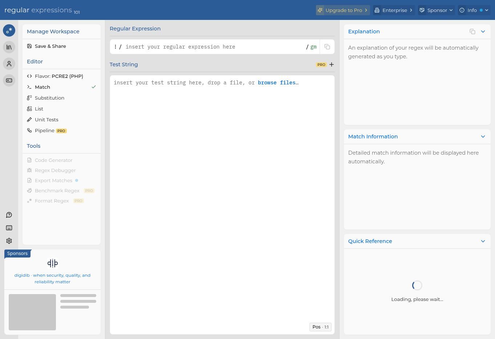
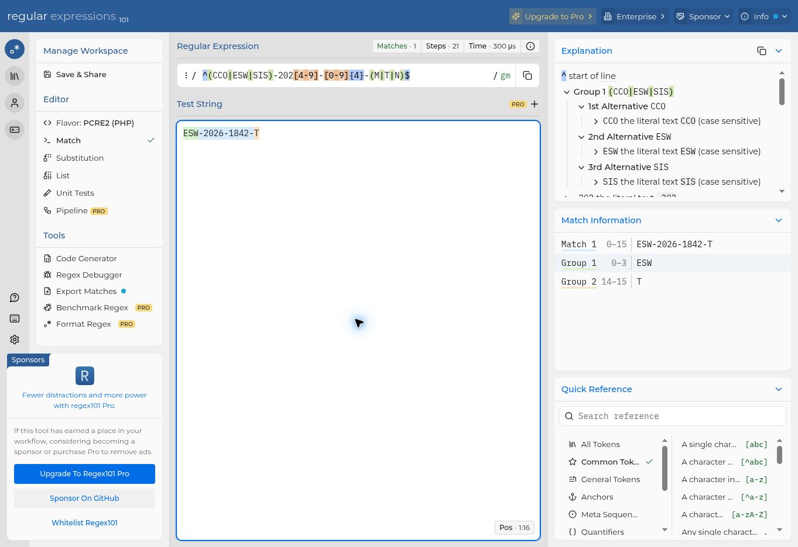

# Relatório — Expressões Regulares

## Objetivo

Modelar linguagens formais por meio de expressões regulares, verificar exemplos de aceitação e rejeição e relacionar cada padrão à ideia de um autômato finito.

## Notação usada

- `|`: escolha entre alternativas;
- `*`: zero ou mais ocorrências;
- `?`: ocorrência opcional;
- `()`: agrupamento;
- `^` e `$`: início e fim da entrada, usados para não permitir caracteres extras;
- `[A-Z]`, `[a-z]` e `[0-9]`: faixas de caracteres;
- `{n}`: exatamente `n` ocorrências.

---

## Exercício 1 — palavras binárias terminadas em `00`

**Linguagem:**

`L₁ = { w00 | w ∈ {0,1}* }`

Portanto, a palavra pode começar com qualquer sequência binária, desde que os dois últimos símbolos sejam `00`.

**Regex:**

```regex
^(0|1)*00$
```

| Aceitos | Rejeitados |
|---|---|
| `00` | `0` |
| `10100` | `1010` |
| `01100` | `001` |

**Relação com o autômato:** o autômato precisa reter a informação de que os dois últimos símbolos lidos são `00`; o estado final é alcançado somente nessa situação.



---

## Exercício 2 — palavras com exatamente dois `a`

**Linguagem:** palavras sobre o alfabeto `{a,b}` contendo duas, e somente duas, ocorrências de `a`.

**Regex:**

```regex
^b*ab*ab*$
```

Os três blocos `b*` permitem qualquer quantidade de `b`, inclusive nenhuma. A expressão possui apenas dois símbolos `a`, logo uma palavra com três `a` não é aceita.

| Aceitos | Rejeitados |
|---|---|
| `aa` | `a` |
| `aba` | `bbbb` |
| `bbaabb` | `aababa` |

**Relação com o autômato:** os estados podem registrar quantos `a` já foram lidos: nenhum, um, dois ou mais de dois. Apenas o estado correspondente a dois `a` é de aceitação.



---

## Exercício 3 — identificador estruturado

**Linguagem:** identificadores formados por duas letras maiúsculas, três algarismos e uma letra minúscula opcional ao final.

**Regex:**

```regex
^[A-Z]{2}[0-9]{3}[a-z]?$
```

| Aceitos | Rejeitados |
|---|---|
| `AB123` | `A123` |
| `QZ008m` | `AB12` |
| `XY999a` | `xy999` |
| `RT451` | `RT451qq` |

**Relação com o autômato:** cada estado representa a leitura de uma posição do identificador: duas maiúsculas, três dígitos e, opcionalmente, uma minúscula. O autômato aceita ao terminar após o terceiro dígito ou após a letra opcional.



---

## Desafio — matrícula acadêmica

Formato exigido: `CURSO-ANO-NÚMERO-TURNO`.

**Regex:**

```regex
^(CCO|ESW|SIS)-202[4-9]-[0-9]{4}-(M|T|N)$
```

### Justificativa dos blocos

| Bloco | Função |
|---|---|
| `(CCO|ESW|SIS)` | aceita somente os cursos CCO, ESW ou SIS; |
| `202[4-9]` | restringe o ano ao intervalo de 2024 a 2029; |
| `[0-9]{4}` | exige um número com exatamente quatro algarismos; |
| `(M|T|N)` | aceita os turnos M, T ou N; |
| `-` | separa literalmente os quatro blocos; |
| `^` e `$` | impedem prefixos, sufixos ou caracteres adicionais. |

| Aceitos | Rejeitados |
|---|---|
| `CCO-2024-0007-M` | `CCO-2030-0007-M` |
| `ESW-2026-1842-T` | `ESW-2026-842-T` |
| `SIS-2029-9999-N` | `SIS-2029-9999-V` |
| `CCO-2025-1200-N` | `CCO-2025-1200-Nx` |

**Relação com o autômato:** o autômato progride bloco a bloco, validando uma escolha de curso, um ano permitido, quatro dígitos e um turno válido. Qualquer símbolo fora do padrão leva a um estado de rejeição.



## Ferramenta de validação

Os exemplos aceitos exibidos nas evidências foram testados no [Regex101](https://regex101.com/) com o sabor **PCRE2 (PHP)**.
