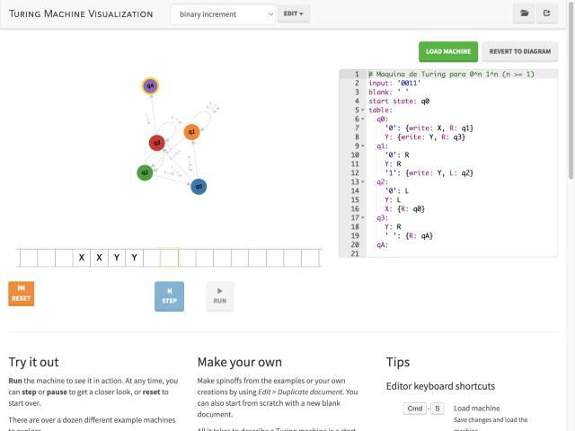
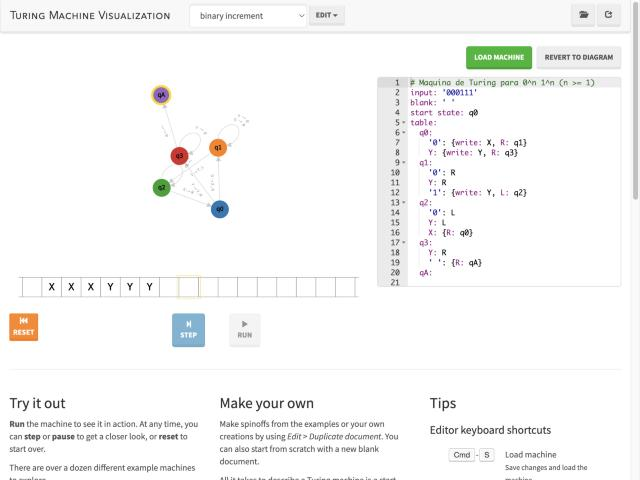
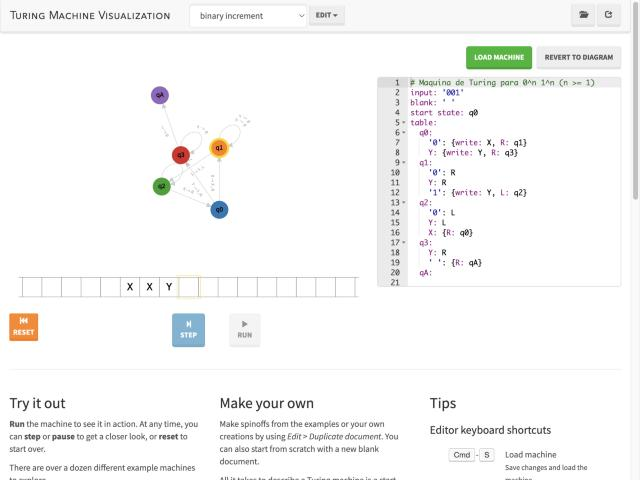

# Registro dos testes

Simulador: [turingmachine.io](https://turingmachine.io/) com o programa de `maquina.yaml`.
Convenção: a máquina **aceita** ao parar em `qA`; **rejeita** ao parar em qualquer outro estado (sem regra para o símbolo lido).

| Teste | Entrada | Resultado esperado | Resultado obtido | Estados percorridos | Passos |
|---|---|---|---|---|---|
| 1 | `0011` | ACEITA | ACEITA | q0 → q1 → q1 → q2 → q2 → q0 → q1 → q1 → q2 → q2 → q0 → q3 → q3 → qA | 13 |
| 2 | `000111` | ACEITA | ACEITA | q0 → q1 → q1 → q1 → q2 → q2 → q2 → q0 → q1 → q1 → q1 → q2 → q2 → q2 → q0 → q1 → q1 → q1 → q2 → q2 → q2 → q0 → q3 → q3 → q3 → qA | 25 |
| 3 | `001` | REJEITA | REJEITA | q0 → q1 → q1 → q2 → q2 → q0 → q1 → q1 | 7 |

## Capturas de tela

| Teste 1 — `0011` (aceita) | Teste 2 — `000111` (aceita) | Teste 3 — `001` (rejeita) |
|---|---|---|
|  |  |  |
